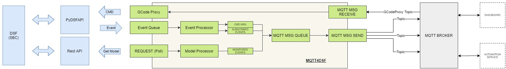

# MQTT4DSF
**A Python script/service to send MQTT msgs from a SBC running Duet DSF. Uses the DSF pydsfapi plugin.**
  
**Currently it can:**  
  
 1. Subscribe to user defined DSF events and send mqtt msgs to a broker of choice on receipt of event (user configurable)
 2. Poll DSF on a timed frequency and send mqtt msgs based on a value delta (user configurable)  
 3. Send user defined MQTT msgs when specially formatted M117 msgs are received from DSF events.  
 4. Act as MQTT to GCode proxy - passing GCode commands to DSF and executing them on the machine, by subscribing to a custom MQTT topic.  
  
Short video of features in use [here](https://www.youtube.com/watch?v=2XwTgxythTE)

This has only been tested on a raspberry pi running DSF from [https://github.com/gloomyandy/RepRapFirmware/wiki](https://github.com/gloomyandy/RepRapFirmware/wiki)

Note: Currently MQTT4DSF is developed using Beta versions of DSF, and therefore much of this code is subject to change.. Best efforts have been made, but further optimisation is required. MQTT4DSF does not currently support secure MQTT brokers (using SSL certificates).
  
**MQTT4DSF has been tested on -DSF FW Ver: 3.2.0-beta2 -Board FW Ver: 3.2-beta2. However it should work with any 3.1.1+ version according to the pydsfapi plugin documentation.   Prior to 3.2 the DSF RestAPI returned a different format of the object model, by prefixing it with 'response'. If you deploy this service on DSF lower than 3.2 you may have to adjust the configuration file to reflect this by changing "MONITORED_MQTT_MSGS/JSON_Variables/DSF_DOM_Path" values. This only applies to "MONITORED_MQTT_MSGS".**   

# Background and use-case  
I decided to put this together after a conversation about MQTT with DUET over on [discord](https://discord.gg/fw3Gqpw) (plus it was an excuse for me to cut my teeth on Python)! MQTT4DSF is designed to be used as a mechanism to integrate DSF with automation applications and other MQTT based services (like dashboards). This can be useful for controlling external devices based on machine events from DSF, building multifunction dashboards for multiple machines (eg print farms), and creating rule based event handling. Some examples of use could include:  
	 - Turning off printer power after xx time has elapsed since completing print.   
	 - Turn off heaters if printer has been left idle for longer than xx (eg. during a forgotten pause event).  
	 - Creating multi-machine dashboards with collective status and alerts.  
	 - Sending emails, or msgs via telegram (or other messaging svs) when a specified event happens.  
	 - Triggering Cameras  

  	  
# High Level Design Overview  

# Installation  
MQTT4DSF requires Python 3, the python paho.mqtt.client, and the DSF dsfpiapi [plugin](https://github.com/Duet3D/DSF-APIs)

It has been developed and tested on rPi 3 & 4.

Please refer to the [other_setup_steps.txt](https://github.com/MintyTrebor/MQTT4DSF/blob/main/other_setup_steps.txt) for an example of how to install all of the dependencies.

Once the dependencies are installed and running, run the following command from your home folder :

    sudo wget -O - https://github.com/MintyTrebor/MQTT4DSF/releases/download/v0.10-ALPHA/Setup_MQTT4DSF.sh | bash

This will deploy MQTT4DSF as a service to the DSF plugin directory. You should review the script before running to ensure you are happy with the approach, or if you wish to deploy manually.

A MQTT4DSF_Config.json configuration file will be placed in the DSF SYS folder, which is accessible through DWC web interface for easy editing. You will need to enter your MQTT broker details in the config file before running the MQTT4DSF service - see **Configuration** section below.

Enter `sudo systemctl start MQTT4DSF.service` to start MQTT4DSF  
Enter `sudo systemctl stop MQTT4DSF.service` to stop MQTT4DSF

MQTT4DSF has a delayed 30sec start to ensure DSF is running after boot of the pi.

After the delayed start, MQTT4DSF will send a start-up msg to the Topic ***Duet/Announce*** ( default settings). The msg should look similar to the below:

    NOW ONLINE:: -Machine: DAFFY -IP: 192.168.3.23 -DSF FW Ver: 3.2.0-beta2 -Board FW Ver: 3.2-beta2

**MQTT Broker Topic Config:**  
The default MQTT4DSF config uses the following topics to send messages:

 - Duet/Announce
 - Duet/[!*MachineName*!] 
 - Duet/[!*MachineName*!]/currtool
 - Duet/[!*MachineName*!]/jobname 
 - Duet/[!*MachineName*!]/joblayer
 - Duet/[!*MachineName*!]/timesleft 
 - Duet/[!*MachineName*!]/temps
 - Duet/[!*MachineName*!]/status
 - Duet/[!*MachineName*!]/dsfmsg
 - Duet/[!*MachineName*!]/displaymsg

The system will automatically replace [!*MachineName*!] with the machine name defined in the MQTT4DSF_Config.json settings file. For example: if machine name is ***DAFFY*** then the topic path will be Duet/DAFFY/currtool. 
  
A log file is located in /var/log/MQTT4DSF.log. The logging level can be changed in MQTT4DSF_Config.json.  
  
# Configuration  
All configuration is done through MQTT4DSF_Config.json which is accessible via the SYS folder of DWC. MQTT4DSF will poll for changes to config and reload settings (once every 10 seconds) which will result in a restart of the service.

***Initial Configuration***  
-Update "MQTT_SETTINGS" with your MQTT broker settings:

    "MQTT_SVR_ADD" : "10.66.1.51",
    "MQTT_SVR_PORT" : 1883,
    "MQTT_Client_Name" : "MQTT4DSF",
    "MQTT_UserName" : "YourUsrNm",
    "MQTT_Password" : "YourPassword"

In "GENERAL SETTINGS" update "MACHINE_NAME" to your machine/printer name. 
Other "GENERAL_SETTINGS" can be updated as required, but the standard settings should work in most cases.

***DSF Event based mqtt messages***  
This class of msg is "pushed" to MQTT4DSF from the DSF Service via the API, configured in the "MQTT_MESSAGES" section of the MQTT4DSF_Config.json.

    {
	    "MsgName" : "Machine Status",
	    "DSF_DOM_Filter" : "state/status",
	    "Type" : "STD",
	    "Enabled" : "Y",
	    "JSON_Variables" : [
		    {"Variable" : "state/status", "Replace_String" : "[!*Status*!]", "Var_Type" : "string", "Msg_Delta" : 0, "lastval" : "noLast"}
		    ],
		"Msgs" : [
			{"MQTT_Topic_Path" : "Duet/Announce", "MQTT_Topic_MSG" : "The Machine [!*MachineName*!] has changed its state to: [!*Status*!]"},
			{"MQTT_Topic_Path" : "Duet/[!*MachineName*!]/status", "MQTT_Topic_MSG" : "[!*Status*!]"}
		]
	}
			

 - "DSF_DOM_Filter"  sets a filter for the DSF event service so that it only pushes updates when the specified value changes. The path should follow the DSF Object Model (which you can browse by activating the Object Model plugin in DWC). The pattern should follow *object/object/variable*. Do not try and filter on objects. If you wish to include more than one variable in the "DSF_DOM_Filter" use *|* as the separator eg  *object/object/variable|object/variable*.
   
 - "Type" should be set to "STD" for user defined msgs.
   
 - "Enabled" = "Y"/"N" to enable or disable the msg.
   
 - "JSON_Variables" are the fields you wish to include in this mqtt msg. 
   
 - Each "JSON_Variables/Variable" entry allows you to define the value to include in the msg text. Normally this should echo the "DSF_DOM_Filter" path. If you have defined more than one variable in the "DSF_DOM_Filter" path then add as many "JSON_Variables/Variable" entries as required.
   
 - "JSON_Variables/Variable/Replace_String" allows you specify the string that identifies where the value should be placed in your msg text.
   
 - "JSON_Variables/Variable/Var_Type" can be one of three values "string", "int", & "time" (normally seconds).
   
 - "JSON_Variables/Variable/Msg_Delta" sets the value by how much the  "JSON_Variables/Variable" should change before a msg is sent. Set to 0 to ignore (0 should be the default for "JSON_Variables/Variable/Var_Type" = "string")  
   
 - "JSON_Variables/Variable/lastval" must be set to "noLast"  
   
 - "Msgs" are where the MQTT Topic and Msg Text are defined. See the example above for reference. Note how the "JSON_Variables/Variable/Replace_String" value is used to define where the value will go in the msg. 
   
 - [!*MachineName*!] is a system variable which can be used anywhere in MQTT Topic and Msg Text.  
 
  
**DSF Polling based monitored mqtt messages**  
This class of msg relies on MQTT4DSF asking for an update from DSF, it operates using an api method which is different to the Event type msgs. The polling frequency is defined by GENERAL_SETTINGS/PollFrequencySeconds in MQTT4DSF_Config.json.

Polling msgs are best used for monitoring values that rapidly/frequently change. They can also be used for groups/arrays of values from the Object Model.

The MONITORED_MQTT_MSGS configuration settings are very similar to Event based msgs, with the following changes:

 - "JSON_Variables/DSF_DOM_Path"  is used to define the path to the DSF Object Model variable(s) excluding the variable name.
 - "JSON_Variables/Variables/Variable" defines the DSF Object Model variable name
 - "JSON_Variables/Variables/Instance" allows control over which array item should be assigned.

Please see MQTT4DSF_Config.json for working examples.

**COMMAND MSGS**  
Sending a specially formatted M117 command to the machine through gcode or the DWC can trigger customisable mqtt messages to be sent. This can be useful for triggering events outside of DWC via an existing automation solution.

Two examples are included in the default MQTT4DSF_Config.json, which can be triggered by sending:

    M117 "MQTTCMD:Test CMD 1"
    M117 "MQTTCMD:Test CMD 2"

The "MQTT_MSG_CMDS" section the the MQTT4DSF_Config.json are where these messages can be configured.

You may choose to alter the command identifier by changing the value of GENERAL_SETTINGS/MQTT_MSG_CMD_Prefix in MQTT4DSF_Config.json.
  
**GCode Proxy Service**  
- The GCode proxy service subscribes to an MQTT topic and passes any msgs received onto the DSF API for execution on the machine.  
- GCode proxy can be enabled/disabled with the config parameter "ENABLE_MQTT4DSF_GCODE_PROXY" : "Y" or "N"  
- The MQTT topic can be specified with the config paramter "MQTT4DSF_GCODE_PROXY_TOPIC" : "Duet/[!*MachineName*!]/gcode" (default)  
- Depending on your MQTT Broker configuration you may also have to configure the topic within the broker.  

**Small Note**  
This is my first Python project so I am sure there is stuff which can be improved within the code...If you have any suggestions they will be welcome. This is a spare time project so updates will not follow a regular schedule. I would like to add a GUI to DWC when the plugin system is finalised.

